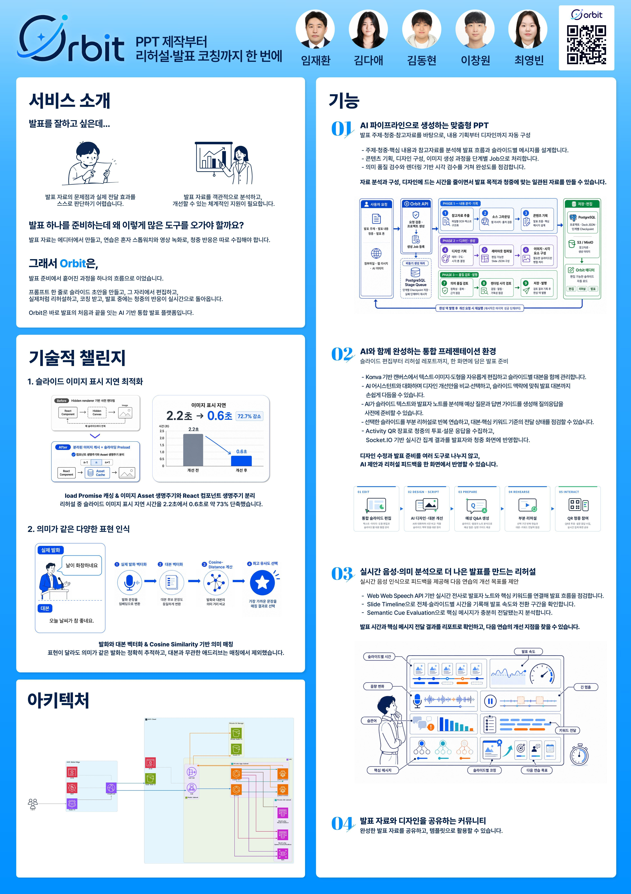

<div align="center">

# 🪐 ORBIT

### 생각을 발표로 바꾸는 가장 빠른 캔버스

**AI로 아이디어를 슬라이드로 만들고, 편집·리허설·발표·청중 참여까지 하나의 흐름에서 완성하는 프레젠테이션 플랫폼**

[](https://github.com/na-man-mu-303-team2/Orbit)

</div>

---

## 💫 ORBIT 소개

ORBIT은 발표 자료를 만드는 순간부터 실제 발표를 마치는 순간까지 이어지는 전 과정을 하나의 워크스페이스로 연결합니다.

단순히 슬라이드를 생성하는 데서 끝나지 않습니다. AI 기반 초안 생성과 캔버스 편집, 발표 대본과 애니메이션, 음성 기반 리허설 분석, 발표자 화면, 실시간 청중 참여와 결과 분석까지 하나의 제품 안에서 제공합니다.

## ✨ 주요 기능

### AI 슬라이드 생성과 편집

- 주제와 참고 자료를 바탕으로 발표 자료 초안 생성
- React Konva 기반의 자유로운 캔버스 편집
- 텍스트, 이미지, 도형, 표와 Smart Art 편집
- AI 이미지 생성과 슬라이드 디자인 제안
- 슬라이드 애니메이션과 발표 대본 관리
- 버전 이력과 자동 저장

### PPTX 입출력

- 기존 PPTX 파일을 프로젝트로 가져오기
- 편집 결과를 PPTX로 다시 내보내기
- 텍스트, 표, 리치 텍스트와 발표자 노트 보존
- 렌더링 및 내보내기 정확도 검증

### 리허설과 발표 코칭

- 발표 음성 녹음 및 STT 기반 분석
- 말하기 속도, 음량, 침묵 구간과 불필요한 추임새 분석
- 슬라이드별 발화 시간과 핵심 키워드 커버리지 확인
- 개인별 연습 목표와 집중 연습 제안
- 예상 질문 생성과 답변 연습

### 발표자 도구

- 발표 화면과 발표자 화면 분리
- 현재 슬라이드, 다음 슬라이드, 대본과 타이머 제공
- 키워드와 발화 흐름을 활용한 발표 진행 보조
- 모바일·태블릿 발표자 Companion 연결
- 슬라이드 애니메이션과 실시간 상태 동기화

### 청중 참여

- QR 또는 세션 코드 기반 청중 입장
- 사전 질문, 실시간 투표, 만족도 조사와 주관식 응답
- 발표자 화면에서 참여 장표 실행 및 결과 공개
- 실시간 집계와 발표 종료 후 결과 확인

### 협업과 커뮤니티

- 프로젝트 단위 멤버와 권한 관리
- Socket.IO와 Yjs 기반 실시간 협업 구조
- 발표 템플릿 탐색, 게시와 재사용

## 🏗️ 서비스 구성

```text
Web (React + Vite + Konva)
        │
        ├── REST API / Socket.IO
        ▼
API (NestJS + TypeORM) ─── PostgreSQL + pgvector
        │
        ├── BullMQ ─────── Redis
        ▼
Worker (NestJS) ────────── Storage (MinIO / S3)
        │
        ▼
Python Worker (FastAPI)
  ├── 문서·PPTX 처리
  ├── STT·오디오 분석
  └── AI 생성·평가
```

ORBIT은 `pnpm` workspace와 Turborepo 기반 모노레포로 구성되어 있으며, 로컬에서는 Docker Compose로 Web, API, Worker, Python Worker, PostgreSQL, Redis와 MinIO를 함께 실행할 수 있습니다.

<div align="center">
  
</div>

## 🛠️ 기술 스택

<div align="center">

### Frontend


### Backend & AI


### Data & Infrastructure


</div>

## 📦 저장소

| 저장소 | 설명 |
| --- | --- |
| [Orbit](https://github.com/na-man-mu-303-team2/Orbit) | ORBIT 메인 모노레포 — Web, API, Worker, Python Worker와 공통 패키지 |
| [Orbit-ASR-server](https://github.com/na-man-mu-303-team2/Orbit-ASR-server) | 음성 인식 실험 및 ASR 서버 |
| [AI-PPT-Companion](https://github.com/na-man-mu-303-team2/AI-PPT-Companion) | ORBIT의 초기 아이디어와 프로토타입 |

## 🔐 설계 원칙

- API, Job과 WebSocket payload는 공통 런타임 스키마로 검증합니다.
- 파일 저장소, 작업 큐와 AI/STT/OCR provider는 교체 가능한 인터페이스 뒤에 둡니다.
- 발표자의 raw audio, transcript 원문과 speaker notes는 청중 API에 노출하지 않습니다.
- 로컬 개발 환경과 운영 환경의 구성 차이를 명시적으로 관리합니다.
- 자동화된 단위·통합·E2E 테스트와 PPTX 정확도 검증을 함께 운영합니다.

---

<div align="center">

**발표의 모든 순간을 연결합니다.**

© 2026 ORBIT

</div>
